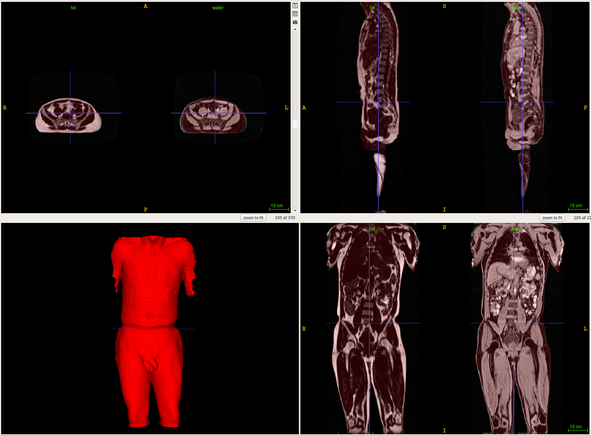
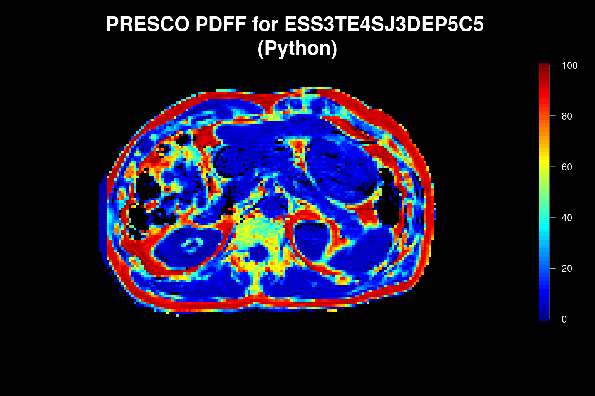

# Image Processing and Quality Control for Abdominal MRI in the UK Biobank

Please cite the following work if you use the software provided here in your research
- Yiu, L., Basty, N., Whitcher, B., Bell, J.D., Sorokin, E., van Bruggen, N., Thomas, E.L., Cule, M.  Genetic 
architecture of 11 abdominal organ traits derived from abdominal MRI using deep learning, 2021, _eLife_, **10**, [DOI: 10.7554/eLife.65554][elife].

## Installation

Execute `git-lfs checkout` in the directory containing the `git clone` output to download the deep learning models and reference data.  We recommend creating a virtual environment in order to run the code 

```
# deactivate
# rm -rf ~/.venv/pipeline
python3 -m venv ~/.venv/pipeline
source ~/.venv/pipeline/bin/activate
pip install pip setuptools wheel
pip install --upgrade pip setuptools wheel cffi numpy
cd ~/pipeline
pip install -r requirements.txt
python setup.py develop
```

The pipeline has been successfully built on Ubuntu 18.04 (Python 3.6) and MacOS 10.14 (Python 3.7). It does depend on 
TensorFlow 1.13.1, which is compatible with 3.3 &leq; Python &leq; 3.7.

To remove the verbose TensorFlow output execute

```
export TF_CPP_MIN_LOG_LEVEL=1
```

on the command line.

## User Interface

The command line interface (CLI) is currently managed using [Python Fire][fire]. Once installation has been successful 
typing `r-coh.py` inside the virtual environment will provide basic options, including the groups available. 
Accessing a group

```
r-coh.py dicom -h
```

exposes the commands available within that group. Typing a command

```
r-coh.py dicom organize -h
```

exposes the parameters required. The command `r-coh.py process` executes the full preprocessing pipeline on a single UK 
Biobank subject. 

## Methods

### Data Management

The following fixed directory tree structure is used in order to streamline image analysis at scale.


- **analysis:** NIfTI files derived from the original datasets; e.g., binary masks and parameter estimates.
- **landmarks:** the predicted landmarks from the bone joints.  
- **nifti:** NIfTI files associated with the four acquisition protocols, after being processed by their respective 
    image analysis pipelines. The number of files depended on the number of MR sequences successfully acquired in 
    the scanning session.
- **plots:** PNG files that captured results from intermediate steps in the pipeline.
- **summary:** summaries of the image data, processing steps and parameter estimates.
- **tmp:** files useful for debugging and troubleshooting in development that may be deleted prior to archival, 
    including the original DICOM files.  

Fixed file names are also defined to simplify automation.  

### Preprocessing

All DICOM files are converted to the NIfTI-1 format using the [dcmstack][dcmstack] python package.


The preprocessing steps are summarized below


#### (a) Dixon 

Bias field correction is performed on the in-phase volume and the estimated bias field applied to the other 
channels (opposed-phase, fat, water) for each series. The series are resampled to a single dimension and 
resolution (size = [224, 174, 370], voxel = 2.232 x 2.232 x 3.0 mm). We apply a nonlinear function to blend the 
signal intensities on regions of overlaping slices.  After blending all series into a single volume the bias field 
correction is performed again.

#### (b) 3D T1w 

Bias field correction is performed on the normalized volume. No additional preprocessing is applied to the 
high-resolution 3D T1w pancreas volumes.

#### (c) Single-slice Multiecho 

We perform bias field correction on each echo time of the magnitude images. For organ/tissue segmentation, we use 
only the bias-field corrected magnitude images. We use the unprocessed data, both magnitude and phase, to estimate 
proton density fat fraction (PDFF) and transverse relaxivity (R2*) using algorithms from the [pdff][pdff] MATLAB 
package.

## Test Data

The UK Biobank Data Showcase provides the following example datasets 

* [Dixon][20201] (ID 20201)
* [3D Pancreas][20203] (ID 20202)
* [IDEAL Liver][20254] (ID 20254) 
* [GRE Pancreas][20260] (ID 20260)

Running them through the pipeline may be performed via

```
wget -nd biobank.ndph.ox.ac.uk/showcase/showcase/examples/eg_20201_abdo.zip
mv eg_20201_abdo.zip 0000000_20201_abdo.zip
wget -nd biobank.ctsu.ox.ac.uk/crystal/crystal/examples/eg_pan_fat.zip
mv eg_pan_fat.zip 0000000_pan_fat.zip
wget -nd biobank.ctsu.ox.ac.uk/crystal/crystal/examples/eg_abdo_idealp.zip
mv eg_abdo_idealp.zip 0000000_abdo_idealp.zip
wget -nd biobank.ctsu.ox.ac.uk/crystal/crystal/examples/eg_panc_gradient.zip
mv eg_panc_gradient.zip 0000000_panc_gradient.zip
r-coh.py process 0000000_20201_abdo.zip . --biobank-project=None
```

...assuming you are already in the virtual environment (see above). 

The fat and water signals, overlayed with the body mask, for the Dixon data: 



The magnitude and phase signals for the liver IDEAL data (first echo time):


The estimated PDFF (%) for the liver IDEAL data:


The magnitude and phase signals for the pancreas GRE data (first echo time):


The estimated PDFF (%) for the pancreas GRE data:




[20201]: http://biobank.ndph.ox.ac.uk/showcase/refer.cgi?id=20201
[20203]: http://biobank.ctsu.ox.ac.uk/crystal/refer.cgi?id=1424
[20254]: http://biobank.ctsu.ox.ac.uk/crystal/refer.cgi?id=558
[20260]: http://biobank.ctsu.ox.ac.uk/crystal/refer.cgi?id=775
[fire]: https://google.github.io/python-fire
[dcmstack]: https://github.com/moloney/dcmstack
[pdff]: https://github.com/marcsous/pdff
[elife]: https://doi.org/10.7554/eLife.65554
